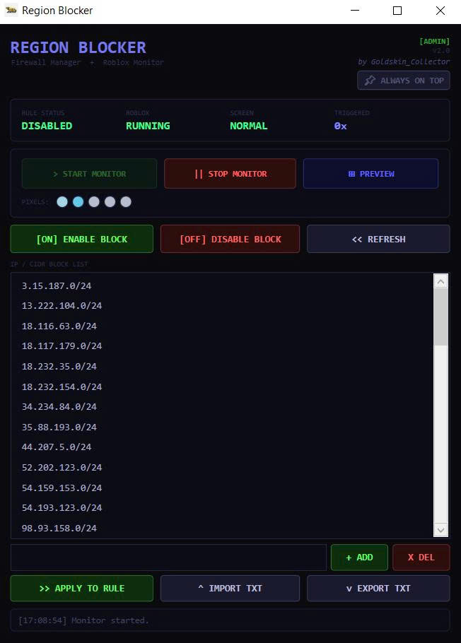
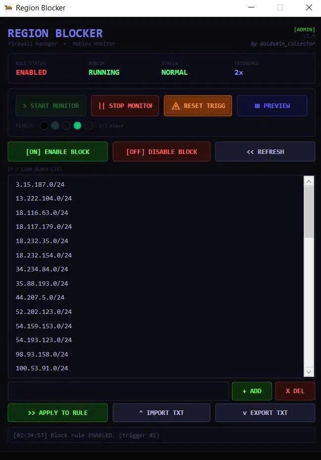
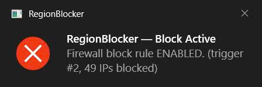
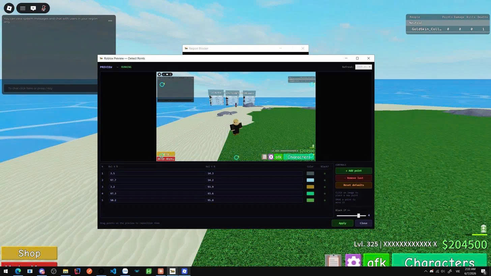
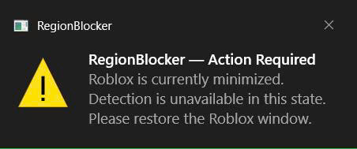

# ABA-Ranked-Anti-lag

🇬🇧 [View in English](README.md)

> Công cụ Windows dành cho người chơi **ABA (Anime Battle Arena)** — tự động chặn server EU/JP/lag trong Ranked, giữ lobby theo khu vực.

---

## Mục lục

- [Cách hoạt động](#cách-hoạt-động)
- [Yêu cầu](#yêu-cầu)
- [Cài đặt](#cài-đặt)
- [Thiết lập lần đầu](#thiết-lập-lần-đầu)
- [Cách dùng](#cách-dùng)
- [Preview window & detect points](#preview-window--detect-points)
- [Xuất IP từ firewall rule](#xuất-ip-từ-firewall-rule)
- [Tính năng](#tính-năng)
- [Vị trí file](#vị-trí-file)
- [Build từ source](#build-từ-source)
- [FAQ](#faq)

---

## Cách hoạt động

Khi Roblox load vào Ranked match, có một khoảnh khắc **màn hình đen ngắn** giữa loading screen và game thật sự. Tool này theo dõi màn hình đen đó bằng cách lấy màu pixel tại các điểm cố định trên cửa sổ Roblox theo thời gian thực.

Ngay khi phát hiện màn hình đen, tool **bật rule chặn outbound của Windows Firewall** chứa dải IP của server bạn muốn tránh. Điều này đẩy bạn về lobby trước khi match kết nối hoàn toàn — không cần Alt-F4 hay tắt game.

Sau khi rule được bật, monitor sẽ không trigger thêm cho đến khi bạn **tắt rule** (bằng nút **[OFF] DISABLE BLOCK** hoặc dừng monitor). Ngay khi rule về trạng thái DISABLED, tool tự động sẵn sàng trigger lại cho lần queue tiếp theo — không cần thao tác thêm.

---

## Yêu cầu

| | |
|---|---|
| OS | Windows 10 / 11 (x64) |
| Runtime | [.NET 8 Desktop Runtime](https://dotnet.microsoft.com/download/dotnet/8.0) |
| Quyền | Administrator (UAC tự động hiện khi khởi động) |

---

## Cài đặt

1. Cài [.NET 8 SDK](https://dotnet.microsoft.com/download/dotnet/8.0).
2. Clone hoặc tải repository này về.
3. Double-click file `build.bat` ở thư mục gốc — nó tự compile và xuất `RegionBlocker.exe` vào `bin\publish\`.
4. Chạy file `.exe` đó với quyền Administrator.

---

## Thiết lập lần đầu



### IP mặc định — chặn tất cả trừ Singapore & Hong Kong
Tool được đóng gói sẵn danh sách IP mặc định gồm các dải server EU, JP và các khu vực lag cao. **Danh sách này chặn tất cả các server không phải Singapore / Hong Kong**, giúp bạn chỉ kết nối vào server gần nhất ngay từ đầu.

Khi mở app lần đầu, danh sách IP đã có sẵn trong ô **IP / CIDR BLOCK LIST**. Bạn chỉ cần:

### 1. Apply danh sách IP vào firewall rule
Nhấn **>> APPLY TO RULE**.
Tool sẽ tự tạo một Windows Firewall rule tên `BlockIP` ở trạng thái **DISABLED**. Monitor sẽ tự bật rule này khi phát hiện màn hình đen.

> Bạn chỉ cần làm bước này **một lần duy nhất**, hoặc mỗi khi thay đổi danh sách IP.

### 2. Thêm / chỉnh sửa IP (nếu cần)
- **Một IP đơn lẻ** — gõ IP hoặc dải CIDR vào ô nhập liệu (ví dụ: `128.116.1.0/24`) rồi nhấn **+ ADD** hoặc **Enter**.
- **Nhiều IP cùng lúc** — paste nhiều IP thẳng vào ô nhập liệu (mỗi dòng một IP, hoặc cách nhau bằng dấu chấm phẩy), rồi nhấn **+ ADD** hoặc **Enter**. Tool xử lý toàn bộ cùng lúc: normalize, validate, bỏ qua trùng lặp, và báo số lượng đã thêm / bị bỏ qua.
  > **Mẹo:** Trong ô nhập liệu, **Shift+Enter** xuống dòng mới để bạn gõ thủ công nhiều IP trước khi nhấn ADD.
- **Import từ file** — nhấn **^ IMPORT TXT** để nạp file `.txt` với mỗi dòng là một IP/CIDR.

Sau khi chỉnh sửa, nhấn **>> APPLY TO RULE** lại để cập nhật rule.

> **Cần thêm IP của các khu vực khác?**
> Bạn có thể xem toàn bộ dải IP server Roblox theo từng khu vực tại [Roblox Developer Forum](https://devforum.roblox.com/t/roblox-server-region-a-list-of-roblox-ip-ranges-and-its-location-so-you-dont-need-to-use-outdatedbrokenexpensive-apis/3094401).
> Nếu muốn chặn thêm các khu vực khác (ví dụ EU, JP, US), chỉ cần copy các dải CIDR tương ứng từ danh sách đó và thêm vào tool theo hướng dẫn ở trên.

### 3. Cấu hình detect points (tuỳ chọn)

Nhấn **⊞ PREVIEW** để mở cửa sổ preview. Khi Roblox đang mở, bạn sẽ thấy thumbnail live của cửa sổ game với các marker màu cyan. Nếu các vị trí mặc định không nằm đúng vùng đen trong loading screen, kéo marker đến vị trí khác rồi nhấn **Apply**.

---

## Cách dùng



### Workflow một session thông thường

```
Nhấn Start Monitor  →  Queue Ranked  →  Phát hiện màn đen  →  Firewall tự bật (ENABLED)
                                                                        ↓
                                                             Bị đá về lobby
                                                                        ↓
                                                        Nhấn [OFF] DISABLE BLOCK
                                                                        ↓
                                                    Queue lại (monitor tự sẵn sàng)
```

### Từng bước

1. Mở app, kiểm tra **RULE STATUS** hiển thị `DISABLED` (màu xanh lá). Nếu hiện `NO RULE`, nhấn **>> APPLY TO RULE** trước.
2. Nhấn **> START MONITOR**.
3. Mở Roblox và queue Ranked match.
4. Monitor phát hiện màn hình đen → tự bật rule chặn → bạn bị đá về lobby.

   > Một **thông báo từ system tray** sẽ hiện lên xác nhận trigger, số lần trigger và số IP đang bị chặn.

   

5. Khi đã về lobby, nhấn **[OFF] DISABLE BLOCK** để tắt rule firewall. Monitor tự sẵn sàng lại — không cần thao tác thêm.
6. Queue lại.

### Điều khiển firewall thủ công

- **[ON] ENABLE BLOCK** — bật rule ngay lập tức.
- **[OFF] DISABLE BLOCK** — tắt rule ngay lập tức, monitor tự re-arm.
- **<< REFRESH** — đọc lại trạng thái rule hiện tại từ Windows và **tự động sync các IP có trong firewall rule nhưng chưa có trong danh sách của app** vào list.

---

## Preview window & detect points



Mở cửa sổ preview bằng **⊞ PREVIEW** khi Roblox đang chạy.

| Thao tác | Chức năng |
|---|---|
| Kéo marker | Di chuyển detect point |
| Click vào ảnh | Đặt detect point mới tại vị trí đó |
| Sửa Rel X% / Rel Y% | Đặt vị trí chính xác theo phần trăm |
| + Add point | Thêm điểm mới ở giữa |
| - Remove last | Xoá điểm cuối cùng |
| Reset defaults | Khôi phục layout 5 điểm mặc định |
| Apply | Lưu vị trí hiện tại và áp dụng cho monitor |

**Color swatch** — hiển thị màu pixel đang lấy mẫu live cho từng điểm.  
**● / ○** — chấm đỏ = điểm đó đang detect đen; xanh = bình thường.  
**Black if ≥ N** — slider điều chỉnh số điểm phải detect đen trước khi trigger bắn (mặc định: 4/5).

> Vị trí detect point được lưu tự động và khôi phục khi mở lại app.

---

## Xuất IP từ firewall rule

Nếu muốn lấy danh sách IP đang có trong rule `BlockIP` ra file `.txt`, chạy lệnh PowerShell sau với quyền Admin:

> **Lưu ý:** Các lệnh dưới dùng `"BlockIP"` làm tên rule — đây là tên mặc định tool tự tạo. Nếu bạn đổi tên rule, hãy thay `"BlockIP"` bằng tên thật. Kiểm tra trong Windows Defender Firewall → Outbound Rules.

```powershell
$rule = Get-NetFirewallRule -DisplayName "BlockIP" -ErrorAction SilentlyContinue
if ($rule) {
    $addresses = ($rule | Get-NetFirewallAddressFilter).RemoteAddress
    $addresses | ForEach-Object { Write-Host $_ }
    Write-Host "`nTotal: $($addresses.Count) IPs" -ForegroundColor Cyan
} else {
    Write-Host "Rule 'BlockIP' not found" -ForegroundColor Red
}
```

Xuất thẳng ra file `.txt` trên Desktop:

```powershell
$rule = Get-NetFirewallRule -DisplayName "BlockIP" -ErrorAction SilentlyContinue
if ($rule) {
    $addresses = ($rule | Get-NetFirewallAddressFilter).RemoteAddress
    $addresses | Out-File -FilePath "$env:USERPROFILE\Desktop\block_ips.txt" -Encoding UTF8
    Write-Host "Đã xuất $($addresses.Count) IPs ra Desktop\block_ips.txt" -ForegroundColor Cyan
} else {
    Write-Host "Rule 'BlockIP' not found" -ForegroundColor Red
}
```

### Workflow chỉnh sửa IP

```
Xuất IP ra .txt  →  Chỉnh sửa file (thêm/xoá IP)  →  Import TXT vào app
                                                              ↓
                                              Xoá IP cũ trong danh sách nếu cần
                                                              ↓
                                                    >> APPLY TO RULE
```

---

## Tính năng

### Phát hiện màn hình đen
- Lấy mẫu pixel qua `PrintWindow`
- Tối đa 5 điểm mẫu có thể kéo thả tùy chỉnh
- Ngưỡng đen điều chỉnh được (1–5 điểm)
- Polling thích ứng: 3 giây khi không tìm thấy Roblox, 300 ms khi đang chạy

### Quản lý Firewall
- Tự động bật rule `BlockIP` outbound khi phát hiện màn đen
- Bật / tắt thủ công bất cứ lúc nào
- Danh sách IP được xây dựng lại sạch mỗi lần bật
- Hỗ trợ IP và CIDR mọi định dạng (`x.x.x.x`, `x.x.x.x/24`, `x.x.x.x/255.255.255.0`)

### Quản lý danh sách IP
- Thêm / xoá từng mục
- **Paste nhiều IP cùng lúc** — paste thẳng vào ô nhập liệu (phân cách bằng xuống dòng hoặc dấu chấm phẩy); mỗi entry được validate, normalize và dedup tự động
- Import từ `.txt` (mỗi dòng một IP hoặc CIDR)
- Export danh sách hiện tại ra `.txt`
- Danh sách tự lưu mỗi khi thay đổi, tự nạp lại khi khởi động

### Refresh & sync
- **<< REFRESH** đọc lại trạng thái rule firewall trực tiếp từ Windows
- Tự động merge các IP có trong rule `BlockIP` nhưng chưa có trong danh sách của app — hữu ích khi bạn chỉnh sửa rule bên ngoài hoặc restore từ backup
- IP được sync sẽ được lưu xuống disk ngay lập tức

### Tự động re-arm
- Trigger bắn mỗi khi phát hiện màn đen **và** rule đang DISABLED
- Không cần nhấn reset thủ công — chỉ cần tắt rule là monitor sẵn sàng lại
- Thông báo balloon từ system tray mỗi lần trigger với số lần và số IP bị chặn

### Cảnh báo khi Roblox bị minimize
- Khi Roblox bị thu nhỏ, tính năng phát hiện không khả dụng
- Một thông báo tray sẽ nhắc bạn mở lại cửa sổ Roblox

  

### Hiển thị trạng thái
- Rule status: `ENABLED` / `DISABLED` / `NO RULE`
- Roblox state: `NOT OPEN` / `LOADING` / `RUNNING` / `MINIMIZED`
- Screen state: `NORMAL` / `BLACK`
- Bộ đếm trigger (tổng trong session)
- 5 chấm màu pixel live
- Log bar hiển thị hành động cuối với timestamp

### Hệ thống
- File `.exe` đơn, không cần dependency ngoài .NET 8 runtime
- Tự UAC elevation khi khởi động
- Toàn bộ config lưu tại `%AppData%\RegionBlocker\`

---

## Vị trí file

```
%AppData%\RegionBlocker\
    iplist.json     — danh sách IP / CIDR đã lưu
    points.json     — vị trí detect point đã lưu
    trigger.log     — lịch sử trigger với timestamp
```

---

## Build từ source

**Yêu cầu:** [.NET 8 SDK](https://dotnet.microsoft.com/download/dotnet/8.0)

```bat
:: Cách 1 — double-click
build.bat

:: Cách 2 — thủ công
dotnet publish -c Release -r win-x64 --no-self-contained -o bin\publish
```

Output: `bin\publish\RegionBlocker.exe`

---

## FAQ

**Q: Rule firewall không được tạo.**  
A: Đảm bảo app đang chạy với quyền Administrator. UAC tự hiện khi khởi động — nếu đã bỏ qua, click chuột phải vào `.exe` và chọn *Run as administrator*.

**Q: Không phát hiện màn hình đen.**  
A: Mở Preview window trong lúc đang ở loading screen và kiểm tra xem có chấm nào chuyển đỏ không. Nếu không, kéo các detect point đến vùng chắc chắn đen rồi nhấn Apply.

**Q: Bị đá mỗi match dù không muốn chặn.**  
A: Đảm bảo rule firewall đang ở trạng thái **DISABLED** trước khi queue. Nhấn **[OFF] DISABLE BLOCK** hoặc **<< REFRESH** để kiểm tra. Chỉ bật monitor khi thực sự muốn chặn.

**Q: Monitor đã trigger nhưng tôi vẫn vào được match.**  
A: Các detect point có thể đang rơi vào vùng tối trong game (ví dụ: cảnh nền tối). Mở Preview window và di chuyển điểm đến vùng sáng hơn trong lúc chơi bình thường.

**Q: App crash khi khởi động.**  
A: Cài [.NET 8 Desktop Runtime](https://dotnet.microsoft.com/download/dotnet/8.0) rồi thử lại.

**Q: Paste nhiều IP nhưng có một số bị bỏ qua.**  
A: Log bar ở dưới cùng sẽ báo số entry đã thêm và số bị bỏ qua do không hợp lệ. Đảm bảo mỗi dòng là một IP hợp lệ (`x.x.x.x`) hoặc dải CIDR (`x.x.x.x/24` hoặc `x.x.x.x/255.255.255.0`). Dòng trống và trùng lặp được bỏ qua không báo lỗi.

**Q: Nhấn REFRESH tự nhiên thêm IP lạ vào danh sách.**  
A: Đây là tính năng sync — REFRESH đọc rule `BlockIP` đang có trong Windows Firewall và merge các IP có trong rule nhưng chưa có trong list của app. Điều này xảy ra nếu bạn từng apply rule với nhiều IP hơn hoặc chỉnh sửa rule bên ngoài. Bạn có thể xoá các entry không muốn rồi nhấn **>> APPLY TO RULE** để ghi đè lại rule.

**Q: Thêm app vào Windows startup?**  
A: Tạo shortcut đến `RegionBlocker.exe` và đặt vào:
```
shell:startup
```
Dán đường dẫn đó vào hộp thoại Run (`Win + R`) để mở thư mục startup.

---

*Made for the ABA community by GoldSkin_Collector*
